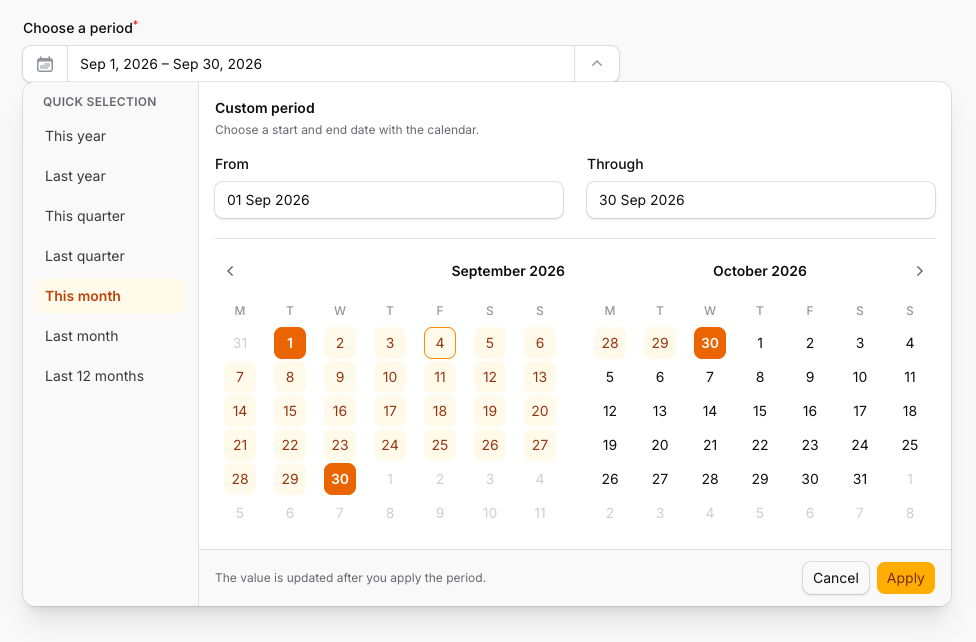

# Filament Period Picker

[](https://packagist.org/packages/rmrook/filament-period-picker)
[](https://packagist.org/packages/rmrook/filament-period-picker)

A reusable Filament form field for selecting a date range. It combines quick presets, two synchronized Filament date inputs, and a shared range calendar in one responsive picker. The calendar shows two consecutive months on wide screens and one month below `1024px`.



The package ships its own lazy-loaded JavaScript, CSS, views, and translations for English, Dutch, French, Italian, German, Spanish, Greek, and Japanese. A consuming application does not need to add Tailwind `@source` directives or register assets manually.

## What you can do

- Select a start and end date from two synchronized inputs or the shared range calendar.
- Use ready-made selections for years, quarters, months, and a rolling 12-month period.
- Add your own fixed or dynamically calculated presets, such as today, this week, the last 30 days, year-to-date, a campaign period, or a booking window.
- Restrict the selectable period with a minimum date, a maximum date, or both.
- Choose the display format separately from the format stored in the form state.
- Use native browser controls or Filament's date picker for the two embedded date inputs.
- Configure both embedded date inputs together or customize the start and end inputs separately.
- Resolve options from closures, including the usual Filament utility injection.
- Localize the interface through Laravel translations, localize date and calendar names separately, and choose the first day of the week.
- Use the same picker on desktop and mobile; the panel adapts to smaller viewports.

The selection is only committed when the user clicks **Apply**. **Cancel** restores the previously applied range. While selecting an end date, the calendar previews the range and starting again with an earlier date resets the range from that date.

## Requirements

- PHP 8.2 or newer
- PHP `intl` extension, required by Filament
- Laravel 11.28, 12, or 13
- Filament 4 or 5

## Installation

Install the Composer package:

```bash
composer require rmrook/filament-period-picker
```

Register the plugin in every Filament panel where the field is used:

```php
use Filament\Panel;
use RMRook\FilamentPeriodPicker\PeriodPickerPlugin;

public function panel(Panel $panel): Panel
{
    return $panel
        // ...
        ->plugin(PeriodPickerPlugin::make());
}
```

Publish Filament's registered assets after installing or updating the package:

```bash
php artisan filament:assets
```

## Basic usage

```php
use RMRook\FilamentPeriodPicker\Forms\Components\PeriodPicker;

PeriodPicker::make('period')
    ->label('Periode')
    ->default([
        'start' => now()->startOfYear()->toDateString(),
        'end' => now()->endOfYear()->toDateString(),
    ]);
```

Always use `start` and `end` in `default()`. The value may be an array or a closure returning an array. The `draft_start` and `draft_end` keys are internal values used by the picker while its panel is open and should not be configured directly.

When the field is used on a custom Filament Page, initialize the form in `mount()`. Filament does not hydrate field defaults until `fill()` is called:

```php
use Filament\Schemas\Schema;
use RMRook\FilamentPeriodPicker\Forms\Components\PeriodPicker;

/** @var array<string, mixed>|null */
public ?array $data = [];

public function mount(): void
{
    $this->form->fill();
}

public function form(Schema $schema): Schema
{
    return $schema
        ->statePath('data')
        ->components([
            PeriodPicker::make('period')
                ->label('Choose a period')
                ->default([
                    'start' => now()->startOfYear()->toDateString(),
                    'end' => now()->endOfYear()->toDateString(),
                ])
                ->required(),
        ]);
}
```

By default, the dehydrated value is an array containing ISO dates:

```php
[
    'start' => '2026-01-01',
    'end' => '2026-12-31',
]
```

## Options

```php
PeriodPicker::make('period')
    ->locale('nl')
    ->firstDayOfWeek(1)
    ->displayFormat('d M Y')
    ->format('Y-m-d')
    ->native(false)
    ->closeOnDateSelection()
    ->minDate('2025-01-01')
    ->maxDate('2027-12-31')
    ->presets([
        [
            'key' => 'campaign',
            'label' => 'Campagneperiode',
            'start' => '2026-09-01',
            'end' => '2026-10-15',
        ],
    ]);
```

| Method | Purpose | Default |
| --- | --- | --- |
| `presets()` | Replace the quick date selections | Built-in presets |
| `minDate()` | Earliest selectable date | No limit |
| `maxDate()` | Latest selectable date | No limit |
| `displayFormat()` | PHP date format shown in both embedded date inputs | `d M Y` |
| `format()` | PHP date format used to hydrate and dehydrate `start` and `end` | `Y-m-d` |
| `locale()` | Locale used for date formatting, month names, and weekday names | Application locale |
| `firstDayOfWeek()` | First weekday as an integer or Carbon weekday constant | Monday |
| `native()` | Use native browser controls for the embedded date inputs | `false` |
| `closeOnDateSelection()` | Close an embedded date input's own calendar after choosing a date | `true` |
| `configureDatePickersUsing()` | Configure both embedded `DatePicker` fields | None |
| `configureStartDatePickerUsing()` | Configure only the start input | None |
| `configureEndDatePickerUsing()` | Configure only the end input | None |

`locale()`, `firstDayOfWeek()`, `displayFormat()`, `format()`, `native()`, `closeOnDateSelection()`, `minDate()`, `maxDate()`, and `presets()` also accept closures with Filament utility injection. Presets with a missing or unparseable date, or with a start after their end, are ignored.

`displayFormat()` controls the two date inputs inside the open panel. It does not change the collapsed field text, which is formatted by the browser's `Intl.DateTimeFormat` for the configured locale. When native inputs are enabled, the browser also controls the inputs' visual format.

`format()` controls the hydrated and dehydrated `start` and `end` values. The picker continues to use ISO `Y-m-d` dates internally. `firstDayOfWeek()` accepts `0` through `7`, following Filament's `DatePicker`; use Carbon weekday constants for clarity. Both `0` and `7` render Sunday as the first day.

Use the configurator methods for presentation options that belong to the embedded inputs, such as labels, placeholders, and extra input attributes:

```php
use Filament\Forms\Components\DatePicker;

PeriodPicker::make('period')
    ->configureDatePickersUsing(
        fn (DatePicker $datePicker) => $datePicker
            ->placeholder('Choose a date')
            ->extraInputAttributes(['autocomplete' => 'off'])
    )
    ->configureStartDatePickerUsing(
        fn (DatePicker $datePicker) => $datePicker->label('Beginning')
    )
    ->configureEndDatePickerUsing(
        fn (DatePicker $datePicker) => $datePicker->label('Ending')
    );
```

The configurator closures may also inject the parent `PeriodPicker` as `$component`, the current picker type as `$type` (`start` or `end`), and the usual Filament utilities. The embedded fields always remain non-dehydrated because the parent field owns the final range value.

Options applied only through these callbacks do not automatically affect the shared range calendar. For example, `disabledDates()` would disable dates in an embedded input but not in the shared calendar. Configure shared behavior with the parent methods such as `minDate()`, `maxDate()`, `locale()`, and `firstDayOfWeek()`. Do not change an embedded field's state path, dehydration, or value format; those are managed by `PeriodPicker`.

Without custom presets, the picker provides:

- This year and last year
- This quarter and last quarter
- This month and last month
- Last 12 months

These ranges are calculated server-side using `config('app.user_timezone')` when it is set, falling back to `config('app.timezone')`.

Calling `presets()` replaces these defaults. Pass an empty array to remove all quick-selection buttons:

```php
PeriodPicker::make('period')
    ->presets([]);
```

A preset adds a quick-selection button; it does not automatically become the field's initial value. Use `default()` with `start` and `end` when a range should already be selected when the form opens.

## Date selection recipes

### Relative date presets

Presets may describe a single day by using the same date for `start` and `end`. Because presets can be returned from a closure, relative periods are recalculated instead of becoming stale.

```php
use Carbon\CarbonImmutable;
use RMRook\FilamentPeriodPicker\Forms\Components\PeriodPicker;

PeriodPicker::make('period')
    ->presets(function (): array {
        $today = CarbonImmutable::now(
            config('app.user_timezone', config('app.timezone')),
        )->startOfDay();

        return [
            [
                'key' => 'today',
                'label' => 'Today',
                'start' => $today->toDateString(),
                'end' => $today->toDateString(),
            ],
            [
                'key' => 'yesterday',
                'label' => 'Yesterday',
                'start' => $today->subDay()->toDateString(),
                'end' => $today->subDay()->toDateString(),
            ],
            [
                'key' => 'this_week',
                'label' => 'This week',
                'start' => $today->startOfWeek()->toDateString(),
                'end' => $today->endOfWeek()->toDateString(),
            ],
            [
                'key' => 'last_7_days',
                'label' => 'Last 7 days',
                'start' => $today->subDays(6)->toDateString(),
                'end' => $today->toDateString(),
            ],
            [
                'key' => 'last_30_days',
                'label' => 'Last 30 days',
                'start' => $today->subDays(29)->toDateString(),
                'end' => $today->toDateString(),
            ],
            [
                'key' => 'month_to_date',
                'label' => 'Month to date',
                'start' => $today->startOfMonth()->toDateString(),
                'end' => $today->toDateString(),
            ],
            [
                'key' => 'year_to_date',
                'label' => 'Year to date',
                'start' => $today->startOfYear()->toDateString(),
                'end' => $today->toDateString(),
            ],
        ];
    });
```

Each preset requires valid `start` and `end` dates, and the start must not be after the end. Supply a unique `key` and a visible `label` for predictable rendering. When omitted, the key is generated from the two dates and the label becomes an empty string.

Preset ranges are not filtered against `minDate()` or `maxDate()`. If a preset falls outside those limits, it can be selected but cannot be applied. Keep custom presets within the configured bounds.

### Keep the defaults and add more presets

Use the component in the preset closure when you want to extend the built-in list instead of replacing it:

```php
use RMRook\FilamentPeriodPicker\Forms\Components\PeriodPicker;

PeriodPicker::make('period')
    ->presets(fn (PeriodPicker $component): array => [
        ...$component->getDefaultPresets(),
        [
            'key' => 'launch',
            'label' => 'Product launch',
            'start' => '2026-09-01',
            'end' => '2026-10-15',
        ],
    ]);
```

### Only historical dates

This is useful for reports and analytics where future dates should not be selectable:

```php
PeriodPicker::make('reporting_period')
    ->minDate(fn () => now()->subYears(5)->startOfYear())
    ->maxDate(fn () => now());
```

### Only future dates

Use a moving window for bookings, planning, or availability:

```php
PeriodPicker::make('booking_period')
    ->minDate(fn () => today())
    ->maxDate(fn () => today()->addYear())
    ->presets(fn (): array => [
        [
            'key' => 'next_7_days',
            'label' => 'Next 7 days',
            'start' => today()->toDateString(),
            'end' => today()->addDays(6)->toDateString(),
        ],
        [
            'key' => 'next_30_days',
            'label' => 'Next 30 days',
            'start' => today()->toDateString(),
            'end' => today()->addDays(29)->toDateString(),
        ],
    ]);
```

### Localized European dates

Keep ISO dates in the form state while displaying a familiar localized format:

```php
use Carbon\CarbonInterface;

PeriodPicker::make('period')
    ->locale('nl')
    ->firstDayOfWeek(CarbonInterface::MONDAY)
    ->displayFormat('d-m-Y')
    ->format('Y-m-d');
```

To return another format from the field, change `format()`:

```php
PeriodPicker::make('period')
    ->displayFormat('d/m/Y')
    ->format('d/m/Y');
```

The resulting state is then:

```php
[
    'start' => '01/09/2026',
    'end' => '30/09/2026',
]
```

### Configure the start and end inputs differently

The parent field owns the final `start` and `end` state, while the two embedded `DatePicker` fields are available for presentation and input-specific behavior:

```php
use Filament\Forms\Components\DatePicker;

PeriodPicker::make('period')
    ->configureDatePickersUsing(
        fn (DatePicker $datePicker) => $datePicker
            ->extraInputAttributes(['autocomplete' => 'off'])
    )
    ->configureStartDatePickerUsing(
        fn (DatePicker $datePicker) => $datePicker
            ->label('Arrival')
            ->placeholder('Choose arrival date')
    )
    ->configureEndDatePickerUsing(
        fn (DatePicker $datePicker) => $datePicker
            ->label('Departure')
            ->placeholder('Choose departure date')
    );
```

## Working with the selected value

The field dehydrates to `null` until it has a valid start and end date. Once complete, read the two dates from the form's dehydrated state:

```php
$period = $this->form->getState()['period'];

$start = $period['start'];
$end = $period['end'];
```

### Applied values and draft values

The picker keeps two versions of the range while the panel is open:

- `start` and `end` are the applied values. These are returned by `$this->form->getState()` in the configured `format()` and are the only values you should save.
- `draft_start` and `draft_end` temporarily synchronize the two embedded date inputs with the calendar. Clicking **Apply** copies the draft range to `start` and `end`; clicking **Cancel** discards it.

The raw Livewire property may contain all four keys while the form is being edited, and a parent `afterStateUpdated()` hook may therefore receive draft keys. Draft values are implementation details: do not include them in `default()`, database columns, casts, or persistence logic. Use the dehydrated result of `$this->form->getState()` when submitting or saving the range.

When the range is stored directly in one Eloquent attribute, use a JSON column and cast it to an array:

```php
protected function casts(): array
{
    return [
        'period' => 'array',
    ];
}
```

## Translations

The interface copy follows the Laravel application locale and includes English (`en`), Dutch (`nl`), French (`fr`), Italian (`it`), German (`de`), Spanish (`es`), Greek (`el`), and Japanese (`ja`). The field's `locale()` option controls date formatting, month names, and weekday names; it does not switch the translated interface copy or automatically change the first day of the week.

To customize the interface copy, publish the package translations:

```bash
php artisan vendor:publish --tag=filament-period-picker-translations
```

## Testing

```bash
composer test
```

Check or apply PHP formatting with:

```bash
composer format -- --test
composer format
```

## License

MIT
